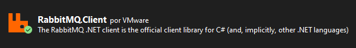
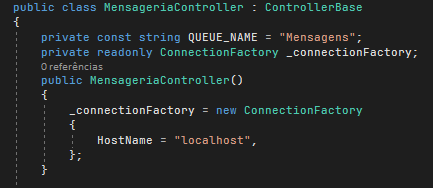
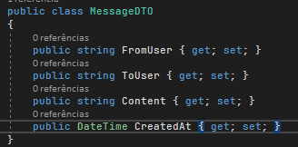
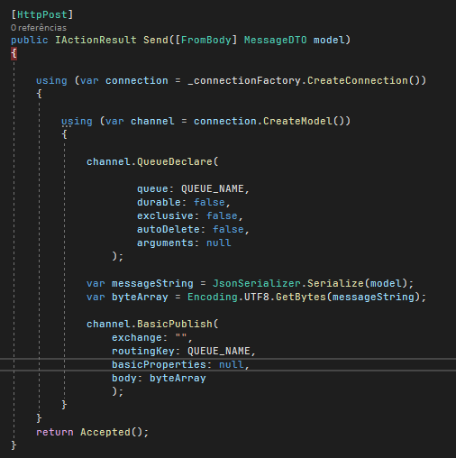
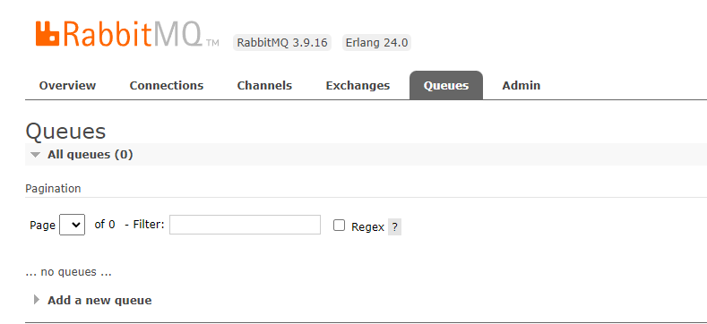
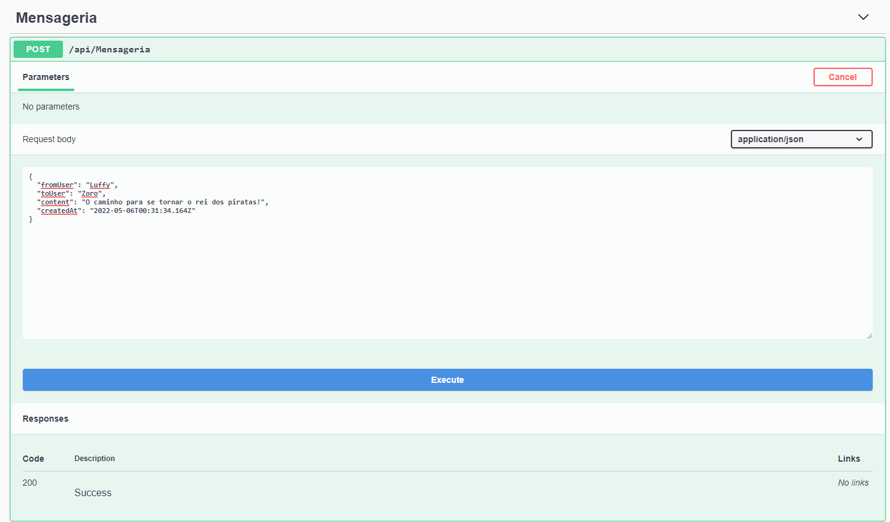
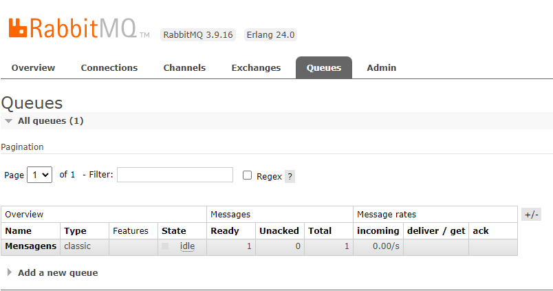
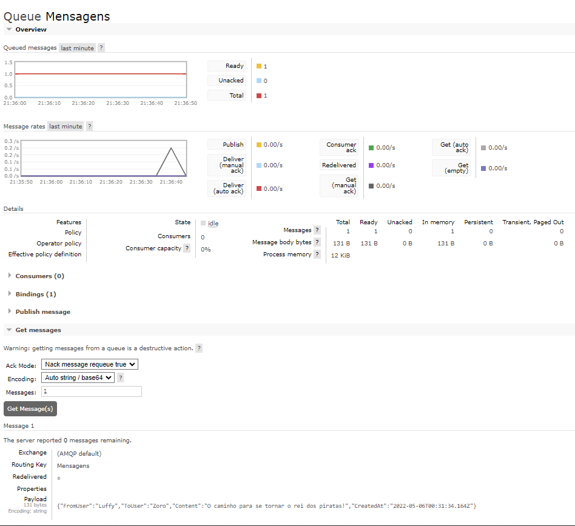

<h1 align='center'>Primeiros passos com RabbitMQ</h1>

Utilizando mensageria RabbitMQ com asp net web api

Esta aplicação é um modelo básico de utilização do rabbitmq junto ao asp net web api. Neste projeto iremos criar uma fila nova e publicar a mensagem nessa fila.

<ol>
<li>O primeiro passo é instalar o Rabbitmq na máquina local</li> 
<li>Depois de criar um projeto de api básico no asp net, basta instalar o pacote RabbitMQ client</li> 

<li>Dentro do controler iremos criar uma constante que terá o nome da fila no rabbitmq e uma variável de leitura do tipo ConnectionFactory que iremos utilizar para realizar a conexão com RabbitMQ. Junto a isso, dentro do construtor, iremos adicionar o HostName como localhost que é a máquina local</li> 

 
<li>Criando um modelo de entrada para o nosso controller</li>
 

<li>Dentro do controller iremos receber pelo corpo da requisição as informações passadas pelo usuário. Logo após, iremos configurar a conexão com rabbitmq, e dentro dessa conexão iremos criar um canal para a mesma. No método <strong>QueueDeclare</strong>, estamos declarando uma fila, os seus parâmetros são respectivamente o <strong>queue</strong> como nome da fila, <strong>durable</strong> como a duração da fila caso o rabbitmq seja reiniciado, <strong>exclusive</strong> se estiver como true, permite apenas uma conexão será permitida a ela, e apos o seu encerramento, a fila sera apagada e o <strong>autoDelete</strong> se estiver assinalada como true, irá apagar a fila apos um consumer ter se conectado ou todos se desconectarem a ela e ficar sem conexões ativas. Após isso, pegamos o model que foi recebido através do corpo da requisição e tornamos ele um JSON através da serialização. Porém, para trafegar as informações pelo rabbitmq precisamos transformar essas informações em um array de bytes. Por ultimo criamos o método responsável por publicar a mensagem na fila. O método BasicPulish conta com os argumentos <strong>exchange</strong> que é responsável por rotear as mensagens para as filas através do cabeçalho, routing key ou bindings. Neste caso ela será feita pela routing key <strong>routingKey</strong> É basicamente um relacionamento entre o exchange e a fila. Com ele podemos dizer para qual fila a mensagem será enviada e o <strong>body</strong> é o conteudo da mensagem que será enviado em formato de array de bytes.</li>

</ol>

<h2 align='center'>Vamos a execução do código.</h2>

<ul>
<li>Primeiro vamos olhar como esta o RabbitMQ antes de rodar a aplicação</li>

Na parte de filas é possível verificar que não há nenhuma fila criada
 
<li>Rodando o projeto e fazendo uma requisição</li>

Apos a requisição podemos notar a mudança que acontece no RabbitMQ com a criação da fila que nos configuramos no projeto

Navegando mais na fila criada podemos verificar as informações que foram passadas através da requisição

Vendo mais detalhes sobre a fila criada, podemos ver que já existe uma mensagem pronta pra ser consumida e na parte inferior, no payload, podemos ver as informações de que foram passadas através da requisição.

</ul>
    
